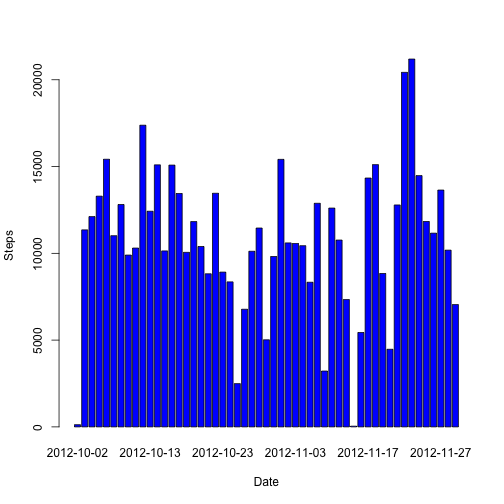
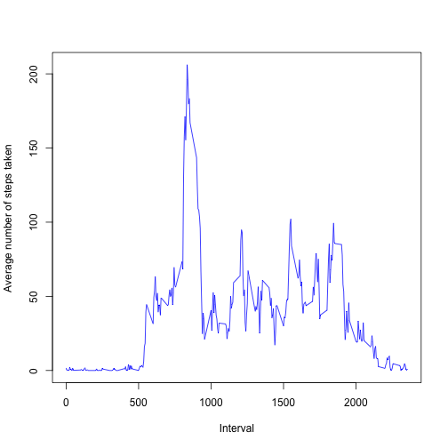
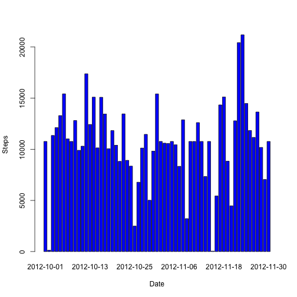
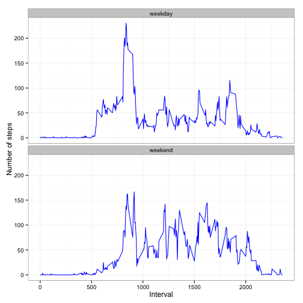

# Reproducible Research: Peer Assessment I
## A. Load and Preprocess the data

```r
library(ggplot2)
setwd("/Users/apple/DataScience/RR/PA1/RepData_PeerAssessment1")
file <- "activity.csv"
df <- read.csv(file, header = T, sep = ',')
```

## B. Histogram, Mean & Median of Steps taken per day
1. Make a histogram of the total number of steps taken each day

```r
stepsbyDate = aggregate(steps ~ date, data = df, FUN = sum)
barplot(stepsbyDate$steps, names.arg = stepsbyDate$date, xlab = "Date", ylab ="Steps", col = "blue")
```

 

2. Calculate and report the mean and median total number of steps taken per day

```r
mean(stepsbyDate$steps)
```

```
## [1] 10766
```

```r
median(stepsbyDate$steps)
```

```
## [1] 10765
```
## C. Average daily activity pattern
1. Make a time series plot (i.e. type = "l") of the 5-minute interval (x-axis) and the average number of steps taken, averaged across all days (y-axis)

```r
stepsbyInterval = aggregate(df$steps,by = list(interval = df$interval),FUN=mean, na.rm=TRUE)
colnames(stepsbyInterval) <- c("interval", "steps")
plot(stepsbyInterval, ylab="Average number of steps taken", xlab="Interval", type='l', col ="blue")
```

 

2. Which 5-minute interval, on average across all the days in the dataset, contains the maximum number of steps?

```r
stepsbyInterval$interval[which.max(stepsbyInterval$steps)]
```

```
## [1] 835
```

## D. Imputing missing values
1. Calculate and report the total number of missing values in the dataset (i.e. the total number of rows with NAs)

```r
sum(is.na(df$steps))
```

```
## [1] 2304
```

2. Devise a strategy for filling in all of the missing values in the dataset. The strategy does not need to be sophisticated. For example, you could use the mean/median for that day, or the mean for that 5-minute interval, etc.

I will use the mean of the 5-minute intervals as the value for imputing

3. Create a new dataset that is equal to the original dataset but with the missing data filled in.

```r
new_df = merge(df, stepsbyInterval, by ="interval", sort = FALSE,suffixes =c("",".avg"))
isNa <- is.na(new_df$steps)
new_df$steps[isNa] <- new_df$steps.avg[isNa]
new_df <- new_df[,c(1:3)]
```

4. Make a histogram of the total number of steps taken each day and Calculate and report the mean and median total number of steps taken per day. Do these values differ from the estimates from the first part of the assignment? What is the impact of imputing missing data on the estimates of the total daily number of steps?

```r
# Plot the Histogram
new_stepsbyDate = aggregate(steps ~ date, data = new_df, FUN = sum)
barplot(new_stepsbyDate$steps, names.arg = new_stepsbyDate$date, xlab = "Date", ylab ="Steps", col = "blue")
```

 

```r
# Calculate the mean and median
mean(new_stepsbyDate$steps)
```

```
## [1] 10766
```

```r
median(new_stepsbyDate$steps)
```

```
## [1] 10766
```
Mean of the imputed values is the same as the mean calculated in the first part of the assignment (10766) whereas the median differ by just one (10765 & 10666). It can be concluded that the impact of imputing values is rather minimal or even negligible in this case.

## E. Are there differences in activity patterns between weekdays and weekends?
1. Create a new factor variable in the dataset with two levels – “weekday” and “weekend” indicating whether a given date is a weekday or weekend day.

```r
daytype <- function(date){
        if (weekdays(as.Date(date)) %in% c("Saturday","Sunday")){
                "weekend"
                }
        else{
                "weekday"
                }
}
new_df$daytype <- factor(sapply(new_df$date, daytype))
```
2. Make a panel plot containing a time series plot (i.e. type = "l") of the 5-minute interval (x-axis) and the average number of steps taken, averaged across all weekday days or weekend days (y-axis). 

```r
# Create a new data frame with the avg number of steps taken grouped by 5 minute intervals and daytype
stepsbydaytype = setNames(aggregate(new_df$steps,by = list(new_df$interval ,new_df$daytype),FUN=mean, na.rm=TRUE) , c("interval", "daytype", "steps"))


# Panel Plot using ggplot
ggplot(stepsbydaytype, aes(x=interval, y=steps)) + 
        geom_line(color="blue", size=0.5) + 
        facet_wrap(~daytype, nrow=2, ncol=1) +
        labs(x="Interval", y="Number of steps") +
        theme_bw()
```

 
